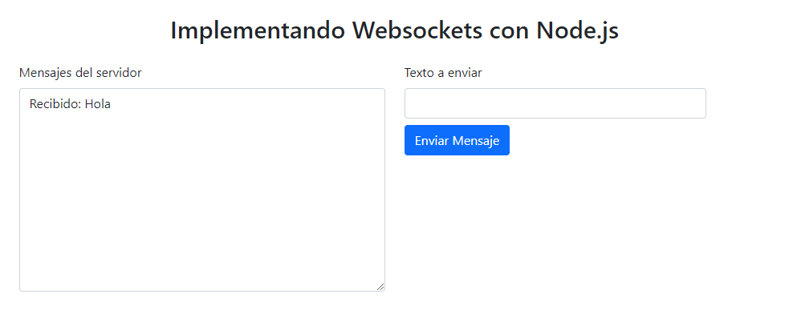

# websocket-basic-implementation

This is a example to implement websockets with nodejs.
Article: [WebSockets con Node.js](https://www.jacobsoft.com.mx/en/implementacion-de-websockets-con-node-js/).

## Overview

### Screenshot

Websocket to reveive and send the same message from the client.

### Built with

- NodeJS v29.9.0
- cors v2.8.5
- express v4.21.0
- websocket v1.0.35
